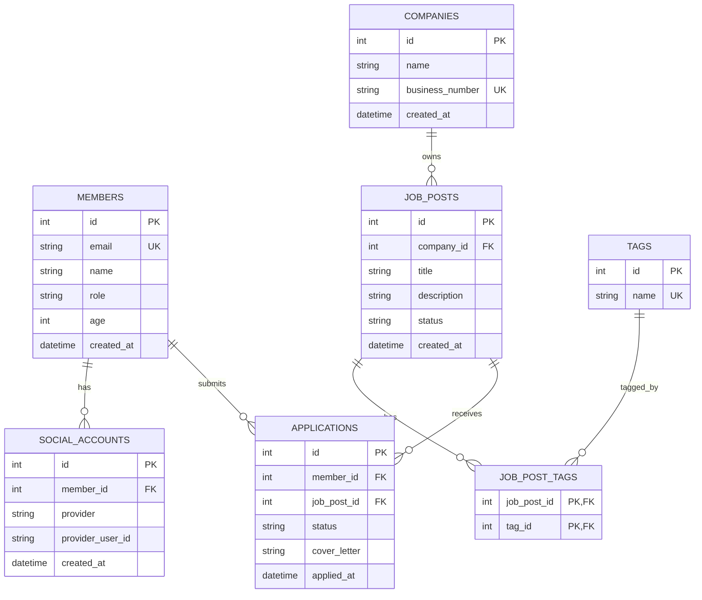

# 연습용 채용 플랫폼

## 실행 방법

```bash
DEBUG=true uv run uvicorn main:app --reload --port 8016
```

## 서비스 한 줄 설명

- 구직자가 계정을 만들고, 회사를 조회하고, 채용 공고를 탐색하고, 원하는 공고에 지원할 수 있는 채용 플랫폼

## 왜 이 스키마로 시작하나

- 기존 예제처럼 제약조건 연습만 모아둔 구조가 아니라, 실제 서비스 흐름이 한 방향으로 이어짐
- 7개 테이블 안에서 PK, FK, 복합 PK, 복합 유니크, CHECK, ON DELETE를 모두 연습할 수 있음
- `members.role`을 통해 역할 기반 설계도 같이 연습할 수 있음

## 테이블 구성

### 1. members

- 서비스 사용자 계정
- 구직자, 채용 담당자, 관리자 모두 이 테이블에 저장
- `role`로 권한을 구분 (job_seeker, recruiter, admin)

### 2. companies

- 회사 정보
- 회사명, 사업자번호 같은 고유 식별 정보를 저장

### 3. social_accounts

- 소셜 로그인 연결 정보
- 하나의 멤버가 여러 소셜 계정을 연결할 수 있음

### 4. job_posts

- 회사가 등록한 채용 공고
- 공고 상태(`OPEN`, `CLOSED`, `PAUSED`)를 관리

### 5. tags

- 기술 스택, 직무, 카테고리 태그
- 예: `python`, `fastapi`, `backend`, `devops`

### 6. job_post_tags

- 채용 공고와 태그의 다대다 연결 테이블
- 조인 테이블이므로 복합 PK가 자연스러움

### 7. applications

- 멤버가 어떤 공고에 지원했는지 기록
- 같은 멤버가 같은 공고에 중복 지원하지 못하도록 막아야 함

## ERD



## 관계 해석

- 한 `member`는 여러 개의 `social_account`를 가질 수 있음
- 한 `company`는 여러 개의 `job_post`를 가질 수 있음
- 한 `job_post`는 여러 개의 `tag`를 가질 수 있고, 한 `tag`도 여러 공고에 붙을 수 있음
- 한 `member`는 여러 공고에 지원할 수 있음
- 한 `job_post`는 여러 지원서를 받을 수 있음

## 핵심 제약조건

### members

- `email` 유니크
- `age > 0` 체크
- `role IN ('CANDIDATE', 'RECRUITER', 'ADMIN')` 체크

### companies

- `business_number` 유니크

### social_accounts

- `(provider, provider_user_id)` 복합 유니크
- 같은 소셜 계정이 중복 연결되지 않도록 보장

### job_posts

- `status IN ('OPEN', 'CLOSED', 'PAUSED')` 체크

### tags

- `name` 유니크

### job_post_tags

- `(job_post_id, tag_id)` 복합 PK
- 같은 태그가 같은 공고에 중복 연결되지 않도록 보장

### applications

- `(member_id, job_post_id)` 복합 유니크
- 같은 멤버가 같은 공고에 중복 지원하지 못하도록 보장
- `status IN ('SUBMITTED', 'REVIEWING', 'REJECTED', 'ACCEPTED')` 체크

## ON DELETE 정책 초안

- `companies -> job_posts`: `CASCADE`
- `job_posts -> job_post_tags`: `CASCADE`
- `tags -> job_post_tags`: `CASCADE`
- `members -> social_accounts`: `CASCADE`
- `job_posts -> applications`: 처음에는 `CASCADE`로 시작해도 됨
- `members -> applications`: 기록 보존 관점에서는 `RESTRICT`가 더 안전함

## role을 왜 members에 두나

- 계정 테이블을 분리하지 않고도 권한 모델을 빠르게 시작할 수 있음
- `CANDIDATE`: 공고 조회, 지원
- `RECRUITER`: 공고 등록, 수정, 마감
- `ADMIN`: 운영 관리

## 나중에 확장할 수 있는 것

- 채용 담당자와 회사 소속 관계를 엄밀히 관리하려면 `company_members` 테이블 추가
- 지원 상태 이력을 따로 관리하려면 `application_status_histories` 테이블 추가
- 이력서 기능이 필요하면 `resumes` 테이블 추가

## 현재 설계의 의도

- 지금은 너무 많은 기능을 넣지 않고, 채용 플랫폼의 핵심 흐름만 남긴 최소 실무형 스키마로 시작함
- 이 정도면 정규화, 제약조건, 참조 무결성, 역할 모델링을 한 번에 연습하기에 충분함
